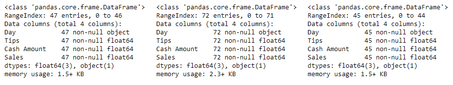
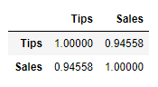
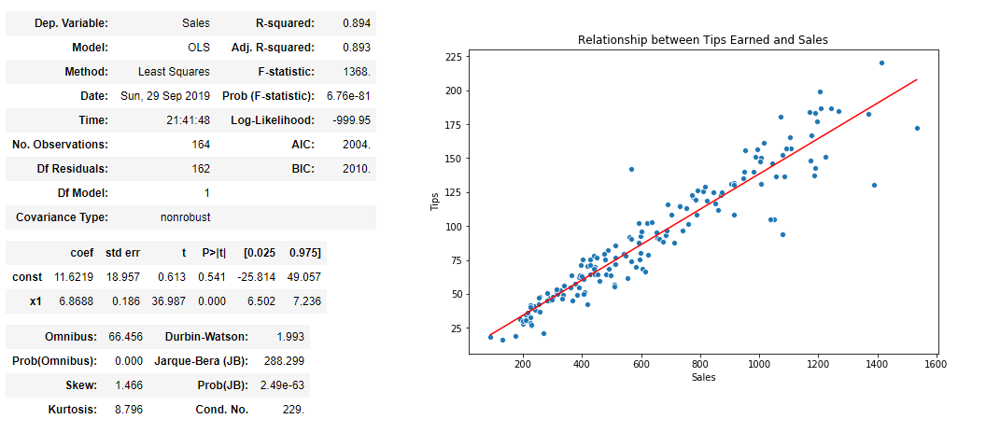
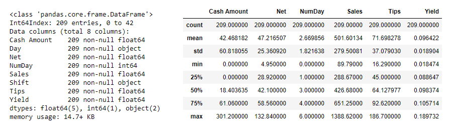
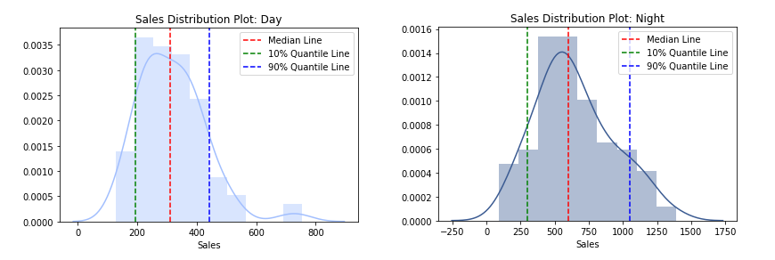
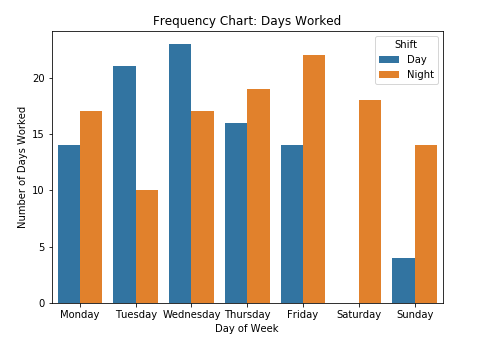
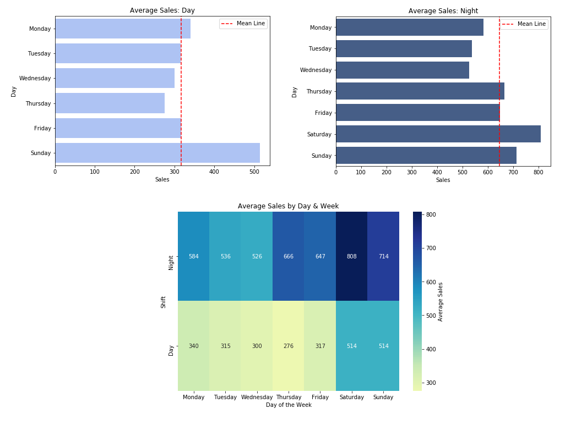
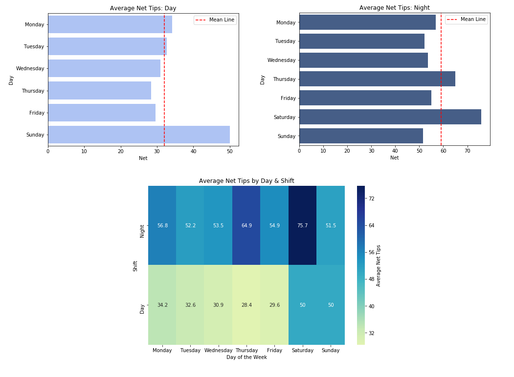
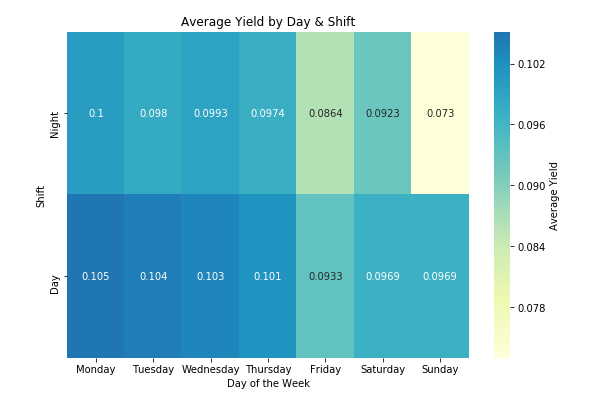

# Server Gratuity Analysis

## The Business Problem

Working as a server, I face the problem of not knowing how much I will make in a given week. This is due to the variability in gratuities, which make up a large portion of my earnings.

There are 2 key metrics that determines my earnings:

  - Sales volume
  - Tip percentage

Both are random in that we cannot predict how many tables I will serve on a given shift and that there is no constant value for tip percentage.

To measure the variability in my earnings and to extract new business insights, I collected 9-months worth of data from my daily cash outs. The main goal for this analysis is to forecast expected earnings and maximize potential earnings.

All analysis was done using Python on Jupyter Notebook utilizing NumPy, Pandas and Matplotlib/Seaborn. The source code can be found in the [Jupyter Notebook file](./analyze_data.ipynb).

## Preprocessing the Data

From my cash outs I extracted the following information into a CSV file:

  - Day Worked
  - Total Tips Received
  - Amount of Cash Received
  - Total Sales

Initially we start out with 3 separate datasets based on the type of shift:

  - [Lunch (Day Shift)](./day.csv)
  - [Dinner (Night Shift)](./night.csv)
  - [Double (Day and Night Shift)](./double.csv)



As we can see above, we do not have any missing values and the datatypes are what we expect it to be.

By appending our 3 datasets we can assess the overall correlation between Sales and Tips. The correlation value between the Sales and Tips is 0.94558, which is a very strong and positive correlation. We can conclude that Sales is a good indicator for determining the tip amount.



We can further visualize the correlation between Sales and Tips through regression analysis. Using StatsModels and Seaborn we get the following:



From the figure above we can see that outliers are present and that there is variability in the data. The outliers and variance of our model is caused by the randomness in tip percentages. Although on average the tip percentage ranges between 10% to 18%, there are times when tip percentages are less than 10% or higher than 18%. The variance can be measured through our R-squared value, which is at 0.894.

Next we want to consolidate our datasets and start analyzing the data. First we need to add 2 new columns to our datasets. The categorical column 'Shift', which tells us whether it was a Lunch shift or Dinner shift, and the 'Net' Tips received. There are tip outs to the kitchen and bartenders at the end of every shift and this works out to 6% of my total sales. To account for the tip out, I subtract 6% of my total sales and account for any cash payments I received. Generally people who pay in cash will tip in cash. By taking the Amount of Sales in Cash, I can estimate how much I am earning from cash tips (randomly generating a tip percentage between 10% to 18%). The Python code for this process can be seen below:

```Python
## Accounting for Tip Out and getting the actual Amount of Tips
day['Net'] = round(day.Tips - (day.Sales * 0.06) + (day['Cash Amount'] * (np.random.randint(10,19) / 100)), 2)
night['Net'] = round(night.Tips - (night.Sales * 0.06) + (night['Cash Amount'] * (np.random.randint(10,19) / 100)), 2)
## Categorizing between Day Shift and Night Shift
day['Shift'] = 'Day'
night['Shift'] = 'Night'
```

As mentioned before, we had 3 different datasets: Day, Night, and Double. The Double dataset consists of days where I worked both a Day and Night shift on the same day. This means that the values on the Doubles dataset accounts for both the Lunch and Dinner shifts. We will extrapolate and separate the Double dataset using statistical inference.

First we will be using the Day and Night datasets to find a correlation between day and night shifts. We remove any excessive outliers using the median by only taking into account data in the 5 to 95 percent quartiles. On average we find that we do about double the amount of sales on a Night shift than a Day shift. Using these metrics we can also formulate a multiple for our double dataset. The Python code is shown below:

```Python
## Removing Outliers
d = day[(day.Sales > day.Sales.quantile(0.05)) & (day.Sales < day.Sales.quantile(0.95))].Sales.mean()
n = night[(night.Sales > night.Sales.quantile(0.05)) & (night.Sales < night.Sales.quantile(0.95))].Sales.mean()

## Ratio of Average Tips Earned during Night vs Day
ratio = n/d
ratio

## Night-Day Multiple
multiple = n / (n+d)
multiple
```

By applying our multiple, which has a value of 0.67, we can split our Double dataset into its Day portion and Night portion.

```Python
## Extrapolating for the Night shifts in the Doubles dataset
double_night.Tips = double.Tips * multiple
double_night.Sales = double.Sales * multiple
double_night['Cash Amount'] = double['Cash Amount'] * multiple

## Extrapolating for the Day shifts in the Doubles Dataset
double_day.Tips = double.Tips - double_night.Tips
double_day.Sales = double.Sales - double_night.Sales
double_day['Cash Amount'] = double['Cash Amount'] - double_night['Cash Amount']

## Append Extrapolated Data into our Datasets
day = day.append(double_day, sort=True)
night = night.append(double_night, sort=True)
```

Now that we have preprocessed all our data, we can consolidate everything into 1 master dataset.

```Python
## Consolidate into 1 dataset
df = day.append(night)
## Create New column for Net Tip Percentage
df['Yield'] = df.Net / df.Sales
```



## Analyzing and Visualizing Data

We will be using Seaborn, which is an extension of Matplotlib, for all our visualizations.

First we will look at the Central Limit Theorem, as illustrated in the figure below. We can see a central tendency around the median and a normal distribution of the data. Using quartiles, we can get a range of what the expected sales can be. We can also see that there is greater dispersion of data in the Night than the Day, meaning that Day shifts are more predictable while Night shifts have higher variability with higher potential of earnings.



We also look at the frequency of the Days worked in the illustration below.



Next we will illustrate our expected Sales based on a day of the week and the shift type. First we will take care of our missing value for our Saturday Day shift, which I have never been scheduled to work. It is fair to assume that a Saturday Day shift will more likely resemble a Sunday Day shift as opposed a Weekday Day shift. For that reason, the Saturday Day shift equals the Sunday Day shift.

Based on the expected Sales illustrated in the figure below, we can draw a few conclusions:

  - The highest Sales volume occurs during the weekend, both during the Day and Night shift
  - There is a higher potential of earning during the Night shift with higher variability
  - Highest Sales during the Day shift is done on Monday, Saturday, and Sunday
  - Highest Sales during the Night shift is done on Thursday, Friday, Saturday, and Sunday



Looking at the Net Earnings from Tips as illustrated in the figure below, we can conclude:

  - Highest Net Earnings during the Night is on Thursday and Saturday
  - Highest Net Earnings during the Day is on Monday, Tuesday, Saturday, and Sunday



Based on the Average Sales and Average Net Earnings from Tips, we can draw the following data of the average Yield, or the net tip percentage on a given day:



We can see from the figure above that the average Yield is around 9% to 10%, meaning that the average tip percentage normalize around 15%. From the figure above we can also draw new conclusions:

  - Sunday Night has low yield, high sales volume and low tip percentage, signifying low efficiency.
  - The most optimal shifts to work are Monday Day, Thursday Night, Saturday Day/Night, and Sunday Day. High volume, high tip percentage.

## Conclusion

With data we can formulate trends in generating business insight. Using the central limit theorem, we can predict expected earnings and maximize potential earnings in the future. From the analysis we can make the following conclusions:

  - Day shifts are more predictable but Night shifts have higher sales volumes
  - On average, people are tipping 15%
  - Friday Night and Sunday Night shifts yield the lowest tip percentage with relatively high sales volume, low efficiency
  - Most money can be made working Thursday and Saturday nights
  - Most money can be made working Monday, Tuesday, Saturday, and Sunday lunches
